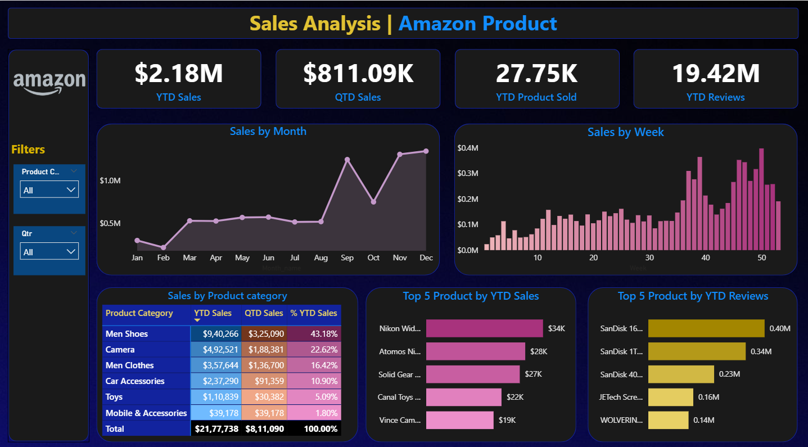

# Amazon Product Sales Analysis Dashboard

## Project Overview

This Power BI dashboard analyzes Amazon product sales performance using interactive visualizations and KPIs.

## Dataset

The dataset contains:

- Product Category
- Product Description
- Price (Dollar)
- Number of Reviews
- Shipment
- Order Date

## Dashboard Features

- YTD Sales Analysis
- QTD Sales Analysis
- Product Sold Analysis
- Customer Review Analysis
- Monthly Sales Trend
- Weekly Sales Trend
- Top 5 Products by Sales
- Top 5 Products by Reviews
- Category-wise Sales Analysis

## Key Insights

- Total YTD Sales: $2.18M
- Men Shoes generated the highest sales contribution.
- Sales peaked during November and December.
- SanDisk products received the highest number of reviews.

## Tools Used

- Power BI
- DAX
- Data Modeling
- Excel

## Dashboard Preview

